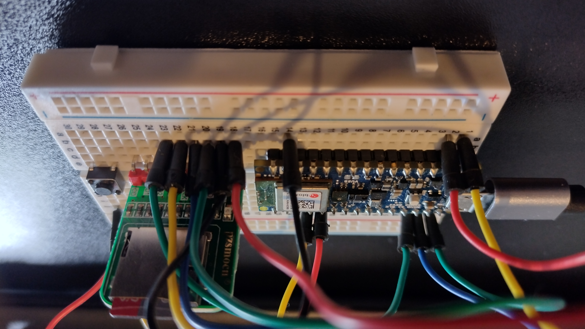
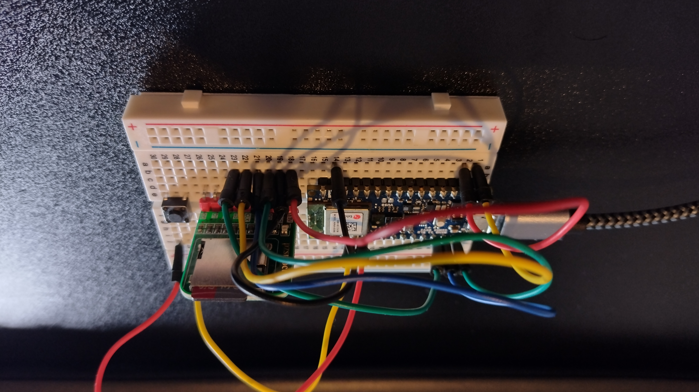
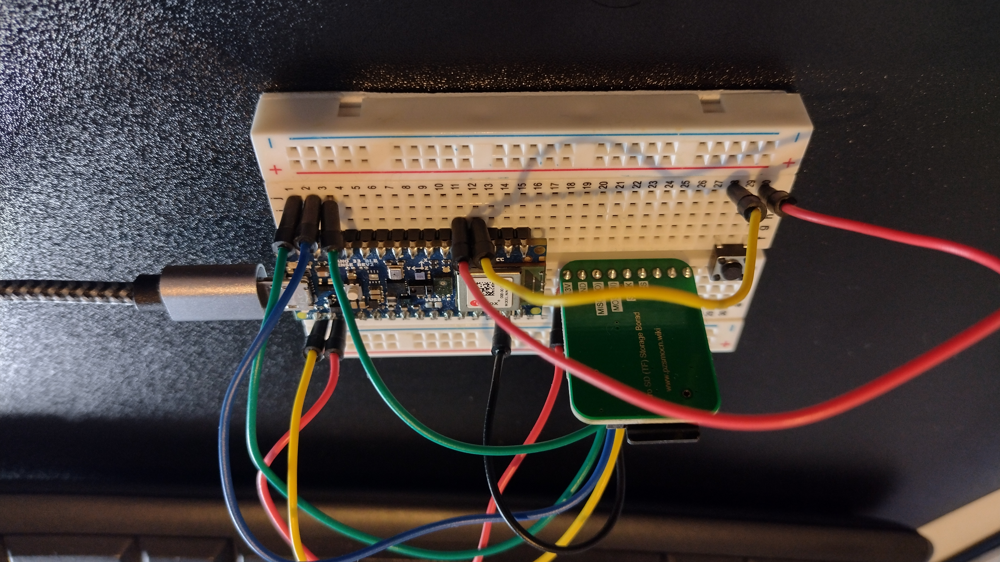

# Arduino - Record audio WAV to SD card

**Board**: Nano 33 BLE Sense Rev2

## Wiring

## Description
The sketch allows to record audio for up to three different users.

### Changing user
After initialising the board, pressing the external pushbutton will switch between the three users. The internal led will display which user is active (user 1: red light, user 2: green light, user 3: blue light).

### Recording data
Once a user is selected, to start recording hold the external pushbutton for a couple of seconds; once released, the recording starts. To stop recording just press the pushbutton again.

WAV files will be created and stored in the format `<user>_<recording_number>.wav`.
